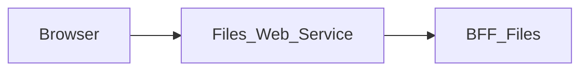

# Files_Web_Service — Technical documentation

[Module overview](module.md) · [Français](../fr/technical.md) · [README](../../README.md)

## Architecture and request handling

Next.js 15.5.25, React 19 and TypeScript application using the App Router. The browser calls same-origin routes; the Next.js server forwards data to **BFF_Files**.



The page loads `/files/bootstrap`, prepares available actions and supplies `FilesModule`. Mutations use `requestBff`; opening and downloading target the binary route. The share action is removed before data is passed to the component.

The generic proxy reads the versioned OpenAPI contract to allow paths and methods. It preserves query parameters, binary bodies, statuses and useful headers, filters transport headers, disables caching and does not automatically follow redirects. Its timeout is 15 seconds.

## Data and persistence

The following sources and limitations describe the associated BFF, which determines persistence for the displayed data.

Bootstrap reads Files API `/api/v1/files/`, `/api/v1/file-categories/` and Core `/api/v1/user/me/`. Files API supplies `canUpload` and `allowedActions`. The BFF forwards bytes and metadata; it does not durably store files or replace missing responses with demo data.

Files API routes and persistence must be available in the deployment. BFF uploads are limited to 20 MiB. The web service hides sharing until a recipient selector is available, even though BFF routes exist.

React state manages display and pending operations. This repository defines no business database of its own; save guarantees come from the BFF and its sources described above.

## Installation and local startup

Use Node.js 22 to reproduce the contract job and npm with the committed lockfile. Other job and Docker versions are detailed below.

Private `@mairie360/*` dependencies require GitHub Packages access. Set `NODE_AUTH_TOKEN` in the environment to a token allowed to read these packages, as configured in `.npmrc`. Do not commit its value.

```bash
npm ci
```

Create `.env.local` in the repository root. Example for BFFs running on the same machine:

```dotenv
FILES_BFF_URL=http://localhost:4005
USER_BFF_URL=http://localhost:4000
```

Start the associated BFF and BFF User for session flows, then start the web service. Port `5005` below is an explicit local choice to avoid collisions; it is not a claim about ports in every Compose file.

```bash
npm run dev -- --port 5005
```

Open `http://localhost:5005`. To run the build with the Next.js script:

```bash
npm run build
npm run start -- --port 5005
```

## Configuration

Values below are local examples or explicitly described behavior, not production credentials.

| Variable or precedence | Example / stated fallback | Purpose |
| --- | --- | --- |
| `FILES_BFF_URL` → `BFF_FILES_BASE_URL` | http://localhost:4005 | Left-to-right proxy precedence; the URL shown is the local fallback. |
| `USER_BFF_URL` → `BFF_USER_API_URL` | http://localhost:4000 | Separate precedence used by session adapters targeting BFF User. |
| `BFF_CONTRACT_DIR` | ../BFF_Files/contracts | BFF contract directory for synchronization and checking scripts. |

Inside a container, `localhost` refers to that container. Use the BFF service DNS name on the Docker network or a reachable host address. Compose files sometimes include other services and legacy settings; check effective URLs and ports before using them.

## Routes and data contract

Inventory extracted from `contracts/openapi.json`. Replace brace parameters with real identifiers. Detailed types, required fields, responses and any examples are defined in that contract; table statuses are the declared statuses, not an exhaustive list of transport or validation errors.

These data paths are exposed at the same origin through the proxy; Next.js pages are separate. `/openapi.json` and `/swagger.json` are also forwarded. Open the `/docs` Swagger UI directly on the BFF.

| Method | Path | Declared body | Declared statuses |
| --- | --- | --- | --- |
| GET | `/health` | — | 200 |
| GET | `/check_apis` | — | 200, 502 |
| GET | `/files/bootstrap` | — | 200, 401, 502 |
| GET | `/files` | — | 200, 201, 204, 401, 502 |
| POST | `/files` | multipart/form-data | 200, 201, 204, 401, 502 |
| GET | `/files/{fileId}` | — | 200, 201, 204, 401, 502 |
| DELETE | `/files/{fileId}` | — | 200, 201, 204, 401, 502 |
| GET | `/files/{fileId}/download` | — | 200, 201, 204, 401, 502 |
| POST | `/files/{fileId}/shares` | application/json | 200, 201, 204, 401, 502 |
| DELETE | `/files/{fileId}/shares/{shareId}` | — | 200, 201, 204, 401, 502 |

### Pages and local adapters

| Page | Source |
| --- | --- |
| `/` | [src/app/page.tsx](../../src/app/page.tsx) |

| Method | Local route | Source |
| --- | --- | --- |
| GET | `/api/user/me` | [src/app/api/user/me/route.ts](../../src/app/api/user/me/route.ts) |
| POST | `/api/auth/logout` | [src/app/api/auth/logout/route.ts](../../src/app/api/auth/logout/route.ts) |
| GET | `/api/auth/me` | [src/app/api/auth/me/route.ts](../../src/app/api/auth/me/route.ts) |
| GET | `/api/auth/session` | [src/app/api/auth/session/route.ts](../../src/app/api/auth/session/route.ts) |

## Session, permissions and errors

The `/api/auth/me`, `/api/auth/session` and `/api/user/me` adapters use BFF User for session access; `/api/auth/logout` forwards logout. The generic proxy uses an explicit Bearer header or, when absent, the `accessToken` cookie. Business permissions remain those of the BFF and its sources.

The generic proxy returns 400 for an invalid path, 404 for a path outside the contract, 405 for a disallowed method and 502 when the service is unreachable or times out. Upstream responses are preserved, including empty 204/205/304 bodies.

## Synchronization and verification

After changing routes or schemas, export the contract in **BFF_Files** using `npm run contracts:generate`, then run in this repository:

```bash
npm run contracts:sync
npm run contracts:check
npm run test:contracts
npm run lint
npm run build
```

`contracts:sync` copies the BFF contract and regenerates `src/contracts/bff.d.ts`. `contracts:check` also compares a neighboring BFF when present; in an isolated checkout, it checks types against the local committed snapshot. `test:contracts` runs the Node proxy tests.

The type generator is pinned to `openapi-typescript@7.10.1` in `scripts/contracts.mjs` and runs through npm. For documentation-only changes, check links, accuracy in both languages and `git diff --check`; do not regenerate contracts without changing their source.

## CI/CD and Docker execution

The `contracts.yml` job uses Node.js 22, `actions/checkout@v7` and `actions/setup-node@v7`. It runs on pushes, pull requests and manual dispatch; it installs with `npm ci`, checks contracts and runs the associated tests.

`cicd.yml` calls `mairie360/CICD/.github/workflows/frontend-cicd.yml@v1.13.2`, with `cicd_version: v1.13.2` and `node_version: "23"`. Reusable steps and GitHub environments determine actual checks, publications and deployments.

The Dockerfile defaults to `NODE_VERSION=23.10.0` and the Next.js `standalone` build; the image command is `["node", "server.js"]`. Image ports and Compose mappings can differ from the local port suggested above.

Before running Docker, check service variables, build secrets and networks in the repository files. Green CI validates its jobs; it does not prove business-service availability in a remote environment.

## Troubleshooting

Associated BFF diagnostics: A legacy `FILE_API_URL` setting does not configure this client: use `FILES_API_URL`. If the library loads without actions, inspect API permission fields. If a file cannot be downloaded, check the upstream `/content` route and its headers.

For a proxy error, compare the path and method with the inventory, then check the BFF URL and session. For a 401 after navigating between modules, check the `accessToken` cookie, its domain and BFF User. A 404 for a requirement described in `BACKEND.md` may refer to a feature that is only proposed.

## Repository reference

- [src/app/page.tsx](../../src/app/page.tsx)
- [src/lib/bff-client.ts](../../src/lib/bff-client.ts)
- [src/lib/bff-proxy.ts](../../src/lib/bff-proxy.ts)
- [src/app/[...path]/route.ts](../../src/app/%5B...path%5D/route.ts)
- [src/lib/user-bff-proxy.ts](../../src/lib/user-bff-proxy.ts)
- [contracts/openapi.json](../../contracts/openapi.json)
- [src/contracts/bff.d.ts](../../src/contracts/bff.d.ts)
- [scripts/contracts.mjs](../../scripts/contracts.mjs)
- [package.json](../../package.json)
- [.github/workflows/contracts.yml](../../.github/workflows/contracts.yml)
- [.github/workflows/cicd.yml](../../.github/workflows/cicd.yml)
- [Dockerfile](../../Dockerfile)
- [docker-compose.yml](../../docker-compose.yml)

Historical supplements: [BFF.md](../../BFF.md), [BACKEND.md](../../BACKEND.md). Proposed requirements must remain distinct from implemented behavior.
